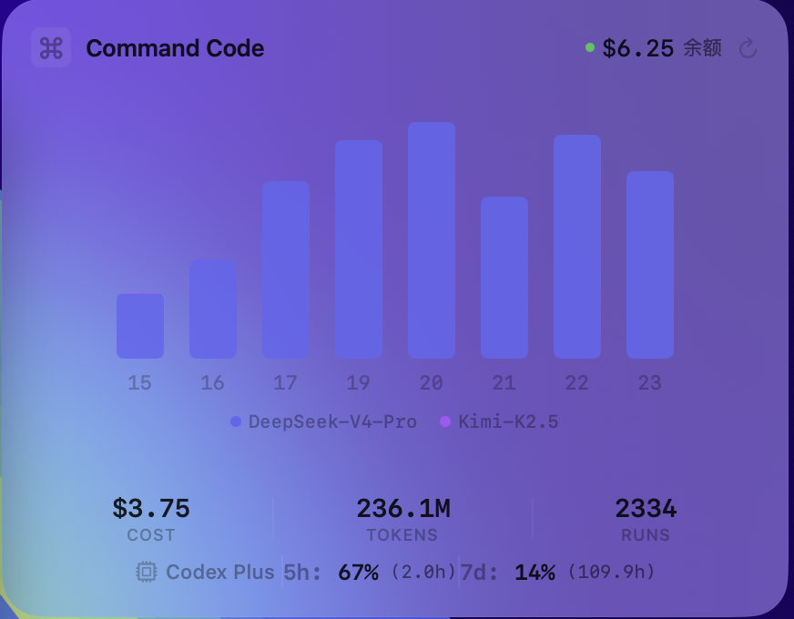

# Command Code + Codex Desktop Widget

> A native macOS desktop widget for monitoring Command Code API usage and Codex CLI rate limits in one compact glass widget.

This is the Codex-enabled version of [Command Code Desktop Widget](https://github.com/MitoroMisaka/commandcode-desktop-widget). If you only use Command Code and do not need Codex rate limits, use the original lightweight widget instead.



## Features

- **Command Code usage at a glance** — total cost, tokens, runs, and monthly credits.
- **Per-model hourly chart** — stacked bar chart for DeepSeek-V4-Pro, DeepSeek-V4-Flash, Kimi-K2.5, Kimi-K2.6, MiniMax, and other models.
- **Codex rate limits** — shows Codex plan plus remaining 5-hour and 7-day quota.
- **Decoupled fetch paths** — Command Code API and Codex RPC are fetched independently, so Codex failures do not block Command Code data.
- **Native macOS desktop widget** — borderless AppKit window at desktop-icon level with SwiftUI content.
- **Glass-morphism UI** — `ultraThinMaterial` when idle and `regularMaterial` when focused.
- **Right-click menu** — refresh data or quit the widget.
- **Auto refresh** — refreshes every 30 minutes and when returning to the desktop.
- **Drag snapping** — 24 px grid alignment for predictable placement.

## Related Projects

- **Command Code only:** https://github.com/MitoroMisaka/commandcode-desktop-widget
- **Command Code + Codex:** this repository

## Requirements

- macOS 26+
- Xcode Command Line Tools (`swiftc`)
- Firefox logged into [commandcode.ai](https://commandcode.ai)
- Codex desktop app installed and logged in
  - Expected RPC binary: `/Applications/Codex.app/Contents/Resources/codex`

## Quick Start

```bash
git clone https://github.com/MitoroMisaka/commandcode-codex-desktop-widget.git
cd commandcode-codex-desktop-widget
./build.sh
open .build/CommandCodeCodex.app
```

## Build Without Xcode

The project uses a small `swiftc` build script; no Xcode project is required.

```bash
swiftc -sdk "$(xcrun --sdk macosx --show-sdk-path)" \
  -target arm64-apple-macos26.0 \
  -framework SwiftUI -framework AppKit -framework Combine -framework Foundation \
  -O \
  -o .build/CommandCodeCodexWidget \
  Sources/Models.swift \
  Sources/TokenExtractor.swift \
  Sources/DataFetcher.swift \
  Sources/CodexFetcher.swift \
  Sources/App.swift
```

## How It Works

### Command Code Data

The widget reads the same internal API endpoints used by Command Code Studio:

| Endpoint | Purpose |
| --- | --- |
| `/internal/usage/summary` | Aggregate usage: cost, tokens, runs, success rate |
| `/internal/usage/charts` | Hourly per-model usage buckets |
| `/internal/billing/credits` | Monthly credit balance |

Authentication comes from Firefox's Command Code session cookie. Firefox keeps `cookies.sqlite` locked while running, so the widget copies the database to `/tmp` before querying it with `sqlite3`.

The default profile path is hardcoded in `Sources/TokenExtractor.swift`:

```swift
static let dbPath = NSHomeDirectory() + "/Library/Application Support/Firefox/Profiles/7wpm1h7n.default-release/cookies.sqlite"
```

If your Firefox profile is different, update that path before building.

### Codex Rate Limits

Codex rate limits are fetched through the Codex app-server JSON-RPC interface:

1. Spawn `/Applications/Codex.app/Contents/Resources/codex app-server`.
2. Send `initialize` with `clientInfo`.
3. Send `account/rateLimits/read`.
4. Parse `primary` and `secondary` buckets.
5. Display remaining quota as `100 - usedPercent`.

The fetcher uses `readabilityHandler` and a hard timeout to avoid UI hangs.

## Stability Notes

- The main `DataFetcher` is `@MainActor`; network and process work run off the main actor.
- Command Code and Codex refreshes are independent.
- A stale Codex process is cancelled before starting a new one.
- Network requests have task-level timeouts to avoid QUIC connection hangs.
- The widget uses a custom `WidgetWindow` so a borderless desktop-level window can receive button and right-click events reliably.

## Privacy

This widget runs locally. It reads your Firefox session cookie from your own machine and sends requests only to Command Code's API and the local Codex app-server process.

No API keys or tokens are stored in this repository.

## License

MIT
